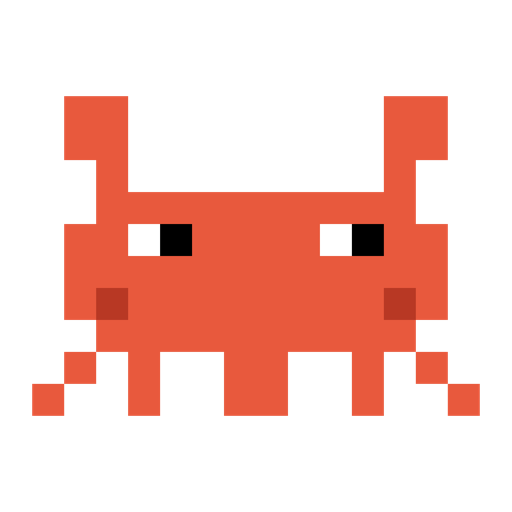

# 🦀 Crab Companion

> Meet **Craby** — a tiny pixel-art crab that lives on top of your Mac screen and tells you what Claude Code is up to. And lets you answer back without touching the terminal.

*Leia em [Português](README.pt-BR.md).*

<p align="center">
  
</p>

You send Claude Code off to work on something long, switch to another app, and… now what? Keep alt-tabbing to check? Craby solves the "is it done yet?" problem by always being in the corner of your eye:

- 😴 **Idle** — claws up, tapping slowly, blinking now and then
- 💻 **Working** — hunched over a tiny laptop, claws hammering the keyboard, keys flying
- 🎉 **Done** — jumping between sparkles (with an optional *pling*)
- ❗ **Needs you** — waving at you with a blinking "!" (with an optional *ping*)

And the best part: when Claude asks for permission or has a question, a **speech bubble** opens under Craby and you can answer right there.

## Features

- **Always visible, never in the way** — floats above every app, on every Space/virtual desktop, even over fullscreen apps. Never steals focus, no Dock icon, invisible to cmd-tab.
- **Menu bar twin** — a mini animated crab in the menu bar, always in sync. Collapse the floating crab into the bar when you need a clean screen ("Recolher para a barra" in its menu).
- **Answer permissions from the bubble** — when Claude Code asks for permission, the bubble shows what it wants to run and *Allow / Deny / Terminal* buttons. Your click answers the real prompt via the official `PermissionRequest` hook. Dangerous-looking commands (`rm`, `push --force`, `sudo`…) get a red border.
- **Ask the user anything** — a local HTTP API lets Claude (or any script) ask multiple-choice or free-text questions through the bubble, with graceful fallback to the terminal.
- **Multi-session scoreboard** — running several Claude Code sessions? The crab shows the highest-priority state across all of them, with white dots for parallel working sessions and a tooltip listing each project's status. Clicking the crab raises the window of the project that needs you (requires Accessibility permission).
- **Sounds** — subtle *pling* on done, *ping* on attention. Toggle in the menu bar menu.
- **Safe by design** — if you don't answer a bubble in time, everything falls back to the normal terminal prompt. The crab never decides anything by itself.

## Install

Requirements: macOS 13+, [Xcode Command Line Tools](https://developer.apple.com/xcode/resources/) (`xcode-select --install`), `jq` (`brew install jq`), and [Claude Code](https://claude.com/claude-code).

```bash
git clone https://github.com/duperez/crab-companion.git
cd crab-companion
./install.sh
```

The installer compiles the app (~300 KB, zero dependencies), installs it to `~/Applications/Crab Companion.app`, registers a LaunchAgent so it starts at login, and adds the Claude Code hooks to `~/.claude/settings.json` (your previous config is backed up, and existing hooks on the same events are never overwritten).

Restart any open Claude Code sessions and you're done. To remove everything: `./uninstall.sh`.

## How it works

```
Claude Code ── hooks ──> localhost:4923 ──> 🦀 (floating window + menu bar)
     ^                                        │
     └────── decision (long-poll HTTP) ───────┘
```

Claude Code fires [hooks](https://code.claude.com/docs/en/hooks) on lifecycle events. Each hook is a tiny script that POSTs to the crab's local HTTP server:

| Hook event | Crab reaction |
|---|---|
| `UserPromptSubmit` | starts typing on the laptop |
| `Stop` | celebrates (done) |
| `Notification` | waves for attention |
| `PermissionRequest` | opens the decision bubble and **waits for your click** |

The `PermissionRequest` flow is the fun one: the hook holds its connection open (long-poll) while the bubble is on screen. Your click travels back as the hook's stdout — an official `permissionDecision` — so the terminal prompt never even appears. No answer in ~45 s? The hook returns nothing and the normal prompt shows up. The crab never auto-approves anything.

## HTTP API

Anything on your machine can talk to the crab:

| Endpoint | What it does |
|---|---|
| `GET /working?session=id&project=name` | mark a session as working |
| `GET /done?...` / `GET /attention?...` / `GET /idle?...` | other states |
| `POST /ask` `{"title","detail","urgent"}` | permission bubble (Allow/Deny/Terminal), long-polls until click |
| `POST /ask` `{...,"options":["A","B"]}` | multiple-choice bubble → answers `opt:0`, `opt:1`… |
| `POST /ask` `{...,"input":true}` | free-text bubble → answers `txt:<typed text>` |
| `GET /answer/<allow\|deny\|ask\|opt:N\|txt:...>` | answer the current bubble programmatically |
| `GET /quit` | quit the app |

Bubble answers: `ask` means "user wants the terminal" — always treat it (and connection errors) as "fall back to the normal flow".

## Let Claude ask you questions through the crab

Add this to your `~/.claude/CLAUDE.md` and Claude will prefer the bubble for quick questions:

```markdown
## Questions via Crab Companion
For short multiple-choice questions, before using AskUserQuestion, try:
curl -s --max-time 50 -X POST -H 'Content-Type: application/json' \
  -d '{"title":"[<project>] Claude has a question","detail":"<question>","urgent":false,"options":["A","B"]}' \
  http://localhost:4923/ask
Response `opt:N` = option index N; `txt:<text>` = typed answer (use `"input":true` instead of options);
`ask`/empty = fall back to AskUserQuestion.
```

## Development

Everything lives in one file, [`main.swift`](main.swift) (~700 lines of AppKit, no dependencies). The sprites are character grids — editing the crab is literally editing text:

```
".RR........RR.",
".RR........RR.",      R body   W/B eyes
"..R........R..",      D shade  Y effects
"..RRRRRRRRRR..",      G/L laptop
".RRWBRRRRWBRR.",
```

Dev loop: `swiftc main.swift -o pet && ./pet`, then `curl localhost:4923/working` to poke states. To ship your change into the installed app, just run `./install.sh` again.

## License

[MIT](LICENSE) — built with [Claude Code](https://claude.com/claude-code), naturally. 🦀
