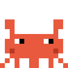

# 🦀 Crab Companion

> Meet **Craby** — a tiny pixel-art crab that lives on top of your Mac screen and tells you what Claude Code is up to. And lets you answer back without touching the terminal.

*Leia em [Português](README.pt-BR.md) · Website: [duperez.github.io/crab-companion](https://duperez.github.io/crab-companion/)*

<p align="center">
  
</p>

You send Claude Code off to work on something long, switch to another app, and… now what? Keep alt-tabbing to check? Craby solves the "is it done yet?" problem by always being in the corner of your eye:

- 😴 **Idle** — claws up, tapping slowly, blinking now and then (and when everything stays quiet for 10 minutes, he falls asleep — Zzz)
- 💻 **Working** — hunched over a tiny laptop, claws hammering the keyboard, keys flying
- 🎉 **Done** — jumping between sparkles (with an optional *pling*)
- ❗ **Needs you** — waving at you with a blinking "!" (with an optional *ping*)

And the best part: when Claude asks for permission or has a question, a **speech bubble** opens under Craby and you can answer right there.

## Features

- **Always visible, never in the way** — floats above every app, on every Space/virtual desktop, even over fullscreen apps. Never steals focus, no Dock icon, invisible to cmd-tab.
- **Menu bar twin** — a mini animated crab in the menu bar, always in sync. Collapse the floating crab into the bar when you need a clean screen ("Recolher para a barra" in its menu).
- **Answer permissions from the bubble** — when Claude Code asks for permission, the bubble shows what it wants to run and *Allow / Deny / Terminal* buttons. Your click answers the real prompt via the official `PermissionRequest` hook. Dangerous-looking commands (`rm`, `push --force`, `sudo`…) get a red border.
- **Ask the user anything** — a local HTTP API lets Claude (or any script) ask multiple-choice or free-text questions through the bubble, with graceful fallback to the terminal.
- **Multi-session scoreboard** — running several Claude Code sessions? The crab shows the highest-priority state across all of them, with white dots for parallel working sessions and a tooltip listing each project's status. Clicking the crab raises the window of the project that needs you (requires Accessibility permission).
- **Sounds** — subtle *pling* on done, *ping* on attention. Toggle in the menu bar menu.
- **He's alive** — his eyes follow your mouse around the screen, he has spontaneous idle quirks (a little wave, a side-step, blowing a bubble), a sweat drop when a task runs long, a nap when nothing happens, and a confetti celebration when he levels up. From level 3 he wears his rank on his head: hard hat → master's hat → crown. On first launch he introduces himself.
- **Daily stats and levels** — the menu bar shows what happened today (tasks finished, projects, time worked), your day streak, and the last events — click one to jump to that project's window. Craby's level grows from *hatchling* to *legend* as tasks pile up, and the menu tells you when a new version is out.
- **Phone alerts when you're away** — optional: if nobody touches the Mac for 2 minutes and Claude needs you, Craby pings your phone via [ntfy](https://ntfy.sh) (see Configuration).
- **Drag him anywhere** — grab and drop Craby wherever you like; the position is remembered. Bubble shortcuts too: click a bubble, then press 1/2/3 to choose or Esc for the terminal.
- **Custom sprite packs** — the sprites are character grids; drop a `sprites.json` next to his config to reskin Craby entirely (cat? octopus? PRs welcome).
- **English and Portuguese** — UI follows your system language.
- **Safe by design** — if you don't answer a bubble in time, everything falls back to the normal terminal prompt. Craby never decides anything by himself, and the endpoints that *inject decisions* require a local secret token.

## Install

Requirements: macOS 13+, `jq` (`brew install jq`), and [Claude Code](https://claude.com/claude-code).

**Homebrew**

```bash
brew tap duperez/craby
brew install --cask craby
"/Applications/Craby.app/Contents/Resources/setup.sh"   # connects Craby to Claude Code
```

**From source** (also needs Xcode Command Line Tools, `xcode-select --install`)

```bash
git clone https://github.com/duperez/crab-companion.git
cd crab-companion
./install.sh
```

**Prebuilt app** — grab `Craby.app.zip` from [Releases](https://github.com/duperez/crab-companion/releases), unzip into `/Applications`, run `xattr -dr com.apple.quarantine /Applications/Craby.app` (the app isn't code-signed), then run `setup.sh` inside `Craby.app/Contents/Resources/`.

Every path ends the same way: the app lands in `Applications/Craby.app` (~300 KB, zero dependencies), a LaunchAgent starts it at login, and the Claude Code hooks are added to `~/.claude/settings.json` — your previous config is backed up, and existing hooks on the same events are never overwritten. Restart any open Claude Code sessions and you're done. To remove everything: `./uninstall.sh`.

## How it works

```
Claude Code ── hooks ──> localhost:4923 ──> 🦀 (floating window + menu bar)
     ^                                        │
     └────── decision (long-poll HTTP) ───────┘
```

Claude Code fires [hooks](https://code.claude.com/docs/en/hooks) on lifecycle events. Each hook is a tiny script that POSTs to the crab's local HTTP server:

| Hook event | Crab reaction |
|---|---|
| `UserPromptSubmit` | starts typing on the laptop |
| `PostToolUse` | heartbeat — keeps "working" alive (dead sessions go idle after 10 min without one) |
| `Stop` | celebrates (done) |
| `Notification` | waves for attention |
| `PermissionRequest` | opens the decision bubble and **waits for your click** |

The `PermissionRequest` flow is the fun one: the hook holds its connection open (long-poll) while the bubble is on screen. Your click travels back as the hook's stdout — an official `permissionDecision` — so the terminal prompt never even appears. No answer in ~45 s? The hook returns nothing and the normal prompt shows up. The crab never auto-approves anything.

## HTTP API

Anything on your machine can talk to the crab:

| Endpoint | What it does |
|---|---|
| `GET /working?session=id&project=name` | mark a session as working |
| `GET /done?...` / `GET /attention?...` / `GET /idle?...` | other states |
| `POST /ask` `{"title","detail","urgent"}` | permission bubble (Allow/Deny/Terminal), long-polls until click |
| `POST /ask` `{...,"options":["A","B"]}` | multiple-choice bubble → answers `opt:0`, `opt:1`… |
| `POST /ask` `{...,"input":true}` | free-text bubble → answers `txt:<typed text>` |
| `GET /status` | JSON with version, displayed state, level and per-session states |
| `GET /answer/<allow\|deny\|ask\|opt:N\|txt:...>` | answer the current bubble programmatically (**token required**) |
| `GET /quit` | quit the app (**token required**) |

Bubble answers: `ask` means "user wants the terminal" — always treat it (and connection errors) as "fall back to the normal flow".

The two decision-injecting endpoints require a secret so no random local process can approve things on your behalf: pass `?token=$(cat "$HOME/Library/Application Support/Craby/token")` (or the `X-Craby-Token` header). The token is created on first launch, readable only by your user.

## Configuration

Everything optional, all in `~/Library/Application Support/Craby/`:

- `config.json` — phone alerts for when you're away: `{"ntfyTopic": "your-secret-topic"}`. Subscribe to the same topic in the [ntfy app](https://ntfy.sh); Craby posts there when Claude needs you and the Mac has been idle for 2+ minutes.
- `sprites.json` — reskin Craby: `{"states": {"idle": [[14 strings of 14 chars], …], …}, "palette": {"R": "#e8593d"}}`. States you omit keep the default art; invalid grids are ignored.
- `stats.json` — Craby's memory (tasks, time worked, events). Delete it to reset his level.

## Works with any agent

The Claude Code hooks are just one client — the HTTP API is agent-agnostic. Anything that can `curl` can drive Craby: Codex CLI, Gemini CLI, cron jobs, CI scripts, long builds. The simplest integration is [`examples/craby-run`](examples/craby-run), a wrapper that marks a session as working, runs your command, and celebrates (or asks for attention on failure):

```bash
cp examples/craby-run /usr/local/bin/
craby-run npm run build
craby-run codex exec "refactor the tests"
```

For deeper integrations, hit the endpoints directly — see the table above.

## Let Claude ask you questions through the crab

Add this to your `~/.claude/CLAUDE.md` and Claude will prefer the bubble for quick questions:

```markdown
## Questions via Crab Companion
For short multiple-choice questions, before using AskUserQuestion, try:
curl -s --max-time 50 -X POST -H 'Content-Type: application/json' \
  -d '{"title":"[<project>] Claude has a question","detail":"<question>","urgent":false,"options":["A","B"]}' \
  http://localhost:4923/ask
Response `opt:N` = option index N; `txt:<text>` = typed answer (use `"input":true` instead of options);
`ask`/empty = fall back to AskUserQuestion.
```

## Development

Plain AppKit, no dependencies, split into small modules under [`Sources/`](Sources/): `Sprites.swift` (pixel art + states), `HTTPServer.swift`, `Stats.swift`, `L10n.swift`, `App.swift`. The sprites are character grids — editing Craby is literally editing text:

```
".RR........RR.",
".RR........RR.",      R body   W/B eyes
"..R........R..",      D shade  Y effects
"..RRRRRRRRRR..",      G/L laptop
".RRWBRRRRWBRR.",
```

Dev loop:

```bash
swiftc Sources/*.swift -o pet && ./pet     # run standalone
curl localhost:4923/working                # poke states
swiftc Sources/Sprites.swift Sources/HTTPServer.swift Sources/L10n.swift \
  Tests/main.swift -o run_tests && ./run_tests
./install.sh                               # ship your change into the installed app
```

CI runs the build, the tests and shellcheck on every push; tagging `v*` builds a universal binary and publishes the release automatically.

## License

[MIT](LICENSE) — built with [Claude Code](https://claude.com/claude-code), naturally. 🦀
